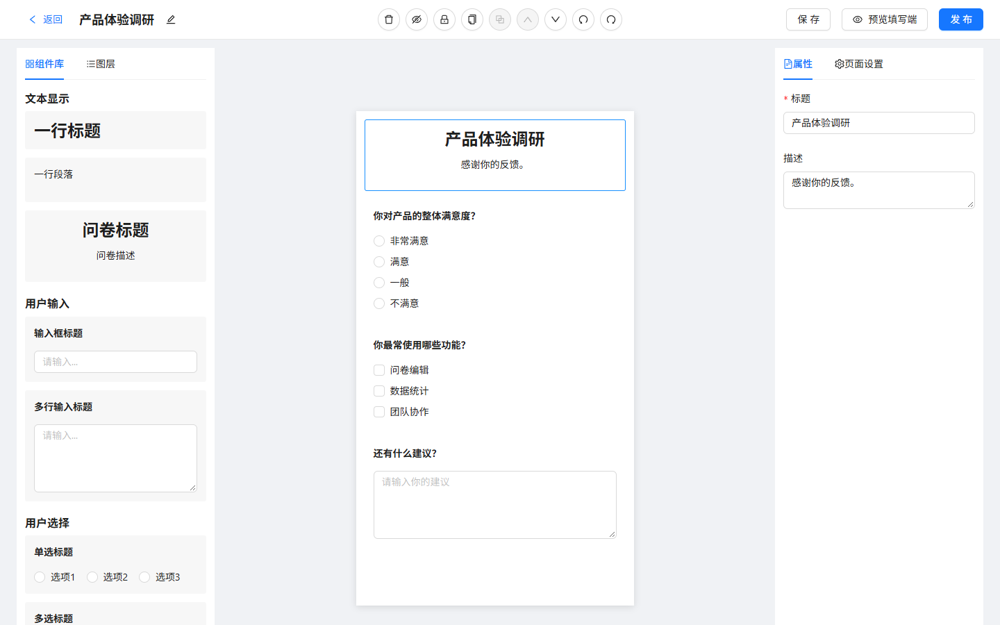
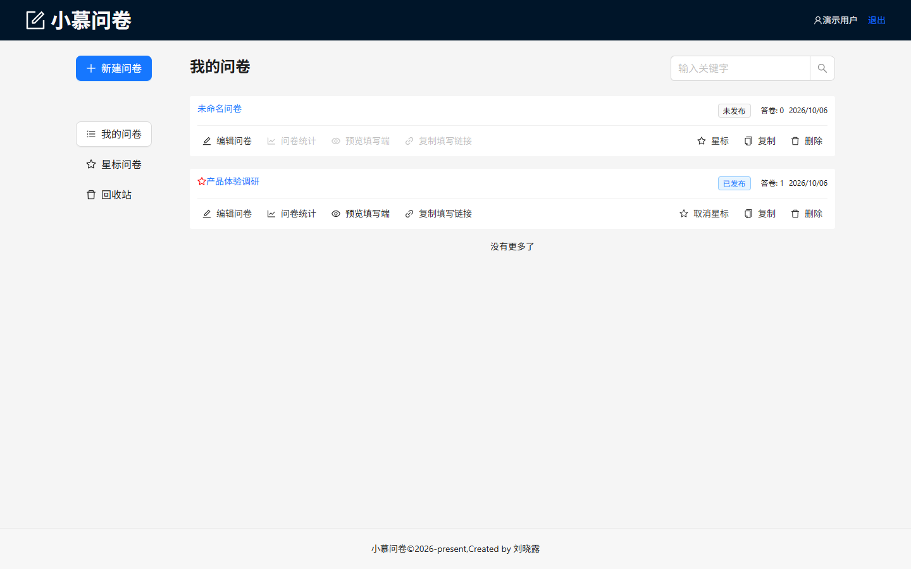
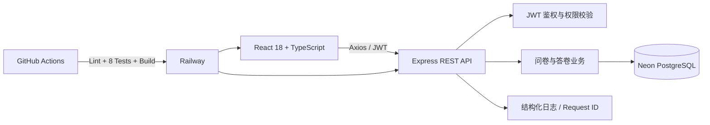

# 小慕问卷

[](https://github.com/1024004866/chaoxinwenjuan2/actions/workflows/ci.yml)

一个可独立运行的在线问卷平台，支持问卷搭建、发布、公开填写、答卷统计和回收站管理。项目采用 React + TypeScript 实现管理端，并在同一仓库内提供 Express API；线上连接 Neon PostgreSQL，适合用于前端工程化和全栈能力展示。

> 在线演示：[https://xiaomu-questionnaire-production.up.railway.app](https://xiaomu-questionnaire-production.up.railway.app)

演示账号：`demo_user` / `demo123`

## 一句话介绍

这是一个带可视化编辑器的问卷 SaaS 原型：用户可以拖拽搭建问卷、发布公开链接，访客提交答卷后，创建者可以在后台查看明细和题目统计图表。

## 项目截图

### 可视化问卷编辑器



### 问卷管理



## 系统架构



核心链路：创建者编辑并发布问卷，访客通过公开链接提交答卷，服务端在事务中写入答卷并更新计数，创建者随后查看答卷明细和图表统计。

## 工程指标

- 3 个测试套件、8 个自动化测试，覆盖组件、状态管理和核心 API 权限流程
- GitHub Actions 自动执行依赖安装、Lint、测试与生产构建
- 路由懒加载后首屏主 JS 从约 `526 KB` 降至约 `284 KB`，减少约 `46%`
- PostgreSQL 采用事务写入、复合索引和参数化查询
- Railway + Neon 提供可公开访问的生产环境

## 功能

- 用户注册、登录、JWT 登录态和退出
- 创建、编辑、复制、星标、发布和删除问卷
- 标题、段落、输入框、文本域、单选、多选等组件
- 拖拽排序、组件隐藏/锁定、复制粘贴、撤销/重做
- 公开填写页 `/question/:id`，支持表单校验和提交成功页
- 答卷明细分页、单选饼图、多选柱状图
- 回收站恢复和彻底删除
- Neon PostgreSQL 线上持久化，本地开发可零配置使用 JSON 数据
- Jest、Testing Library 与 Supertest 自动化测试

## 技术栈

前端使用 React 18、TypeScript、React Router 6、Redux Toolkit、redux-undo、Ant Design、ahooks、Axios、dnd-kit、Recharts 和 Sass。服务端使用 Express、PostgreSQL、JWT、bcryptjs 和 CORS。测试使用 Jest、Testing Library 与 Supertest，构建使用 CRACO。

## 快速启动

```bash
cd react-program
npm install
npm run dev
```

`npm run dev` 会同时启动 Web `http://localhost:3000` 和 API `http://localhost:8000`。也可以分开运行 `npm run server` 与 `npm run web`；`npm start` 用于生产环境启动编译后的应用。

### 前端监控联调

开发环境内置轻量采集模块，会把真实页面访问、Web Vitals、XHR/fetch 请求和浏览器异常上报到 `http://localhost:7001/report`，用于与 `frontend-monitoring-platform` 联调。访客标识保存在 localStorage，监控端根据真实事件计算流量、性能和错误指标。

生产构建默认不启用上报；部署监控服务后可在构建时设置：

```bash
REACT_APP_MONITOR_API_URL=https://你的监控域名/report npm run build
```

首次启动会创建 `.data/db.json`。演示账号为：

```text
用户名：demo_user
密码：demo123
```

线上演示也可以使用该账号登录。Railway 当前使用试用额度，面试前请确认在线地址仍可访问。

## 主要路由

| 路由 | 说明 |
| --- | --- |
| `/` | 首页 |
| `/login` | 登录 |
| `/register` | 注册 |
| `/manage/list` | 我的问卷 |
| `/manage/star` | 星标问卷 |
| `/manage/trash` | 回收站 |
| `/question/edit/:id` | 问卷编辑器 |
| `/question/stat/:id` | 答卷和图表统计 |
| `/question/:id` | 公开填写页 |

## 工程设计

- `src/store/componentsReducer` 管理编辑器组件树，使用 `redux-undo` 保留历史状态。
- `src/components/QuestionComponents` 通过组件配置统一展示、属性编辑和统计组件，方便扩展新题型。
- `src/services` 封装 API 调用，Axios 拦截器统一处理 JWT、错误提示和响应结构。
- `server` 提供与前端服务层匹配的 REST API；数据库层支持 PostgreSQL 与本地 JSON 两种运行模式。
- PostgreSQL 写入使用逐条 `INSERT / UPDATE / DELETE`，提交答卷和更新计数在同一事务内完成。
- 为问卷列表和答卷分页查询建立 `(user_id, is_deleted, created_at)` 与 `(question_id, created_at)` 复合索引，数据库启动时幂等创建。
- Express 初始化与端口监听分离，Supertest 可直接测试 API，不需要占用真实端口或连接线上数据库。
- 发布后的问卷通过当前域名生成分享链接和二维码，不依赖硬编码的 localhost 地址。

## 面试演示流程

1. 用演示账号登录后台。
2. 新建问卷，从左侧组件库添加标题、单选、多选和文本题。
3. 拖拽调整题目顺序，在右侧编辑属性，使用撤销/重做验证编辑器状态管理。
4. 保存并发布问卷，打开统计页复制公开链接。
5. 在新标签页填写并提交答卷。
6. 返回统计页查看答卷明细和单选/多选图表。

完整讲解顺序、常见追问和回答要点见 [面试讲解指南](docs/INTERVIEW_GUIDE.md)。

## 面试可讲的技术点

- 使用 Redux Toolkit 管理组件树和页面信息，用 `redux-undo` 实现编辑器撤销/重做。
- 使用组件配置表统一题目展示、属性面板和统计组件，新增题型只需补充配置和组件。
- 使用 dnd-kit 完成拖拽排序，并处理隐藏、锁定、复制、粘贴和键盘快捷键。
- 使用 Axios 拦截器统一注入 JWT、解析后端响应和处理错误提示。
- 使用 Express 提供 REST API，以 JWT 完成鉴权和资源权限隔离，并使用 Neon PostgreSQL 持久化数据。
- 将答卷写入和答卷计数更新置于同一数据库事务，避免并发写入导致统计数量不一致。
- 使用 Supertest 覆盖鉴权、草稿访问、防越权修改、问卷发布、答卷提交与统计查询。
- 对注册、登录、问卷更新和答卷提交执行类型、长度和体积校验；登录接口按 IP 限制短时间内的失败尝试。
- Express JSON 解析错误统一返回 400，避免把客户端格式错误误报为服务器故障。
- 每个请求都会返回 `X-Request-Id`，并在 Railway 日志中记录请求路径、状态码和耗时；异常日志只记录错误类型与请求 ID，不记录密码、令牌或答卷内容。
- 路由页面使用 `React.lazy` 按需加载，问卷编辑器、统计图表和公开填写端不会阻塞登录页首屏。
- 使用 Recharts 将单选和多选答卷聚合为可视化图表。

## 简历描述（可直接参考）

**小慕问卷 | React + TypeScript + Express**

独立开发并部署在线问卷平台，完成 JWT 用户认证、可视化问卷编辑、拖拽排序、发布分享、公开答卷和数据统计闭环；使用 Redux Toolkit 与 redux-undo 管理编辑器状态，使用 dnd-kit 完成拖拽交互，使用 Express + Neon PostgreSQL 提供持久化 REST API，并通过 Jest、Testing Library 和 Supertest 覆盖核心流程。

## 当前限制

- 未配置 `DATABASE_URL` 时，API 使用 JSON 文件，适合本地演示；配置 PostgreSQL 连接串后会自动建表并使用真实数据库。
- 线上环境部署于 Railway，并连接 Neon PostgreSQL；Railway 试用额度到期后需要更换套餐或迁移服务。

## 验证命令

```bash
npm run lint
npm test -- --runInBand
npm run build
```

GitHub Actions 会在每次推送到 `main` 或提交 Pull Request 时自动执行以上检查。只有代码检查、全部测试和生产构建都通过，CI 状态才会显示为绿色。

## 部署

当前项目部署在 Railway。服务会先构建 React，再由同一个 Node 进程提供静态页面和 `/api` 接口；线上通过 `DATABASE_URL` 连接 Neon PostgreSQL，并通过 `JWT_SECRET` 签发登录令牌。

生产环境必须配置 `DATABASE_URL`、`JWT_SECRET` 和 `NODE_ENV=production`，敏感配置只保存在部署平台环境变量中，不提交到版本库。
